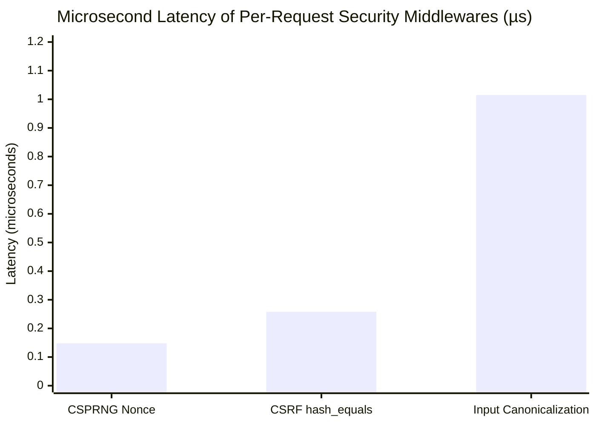
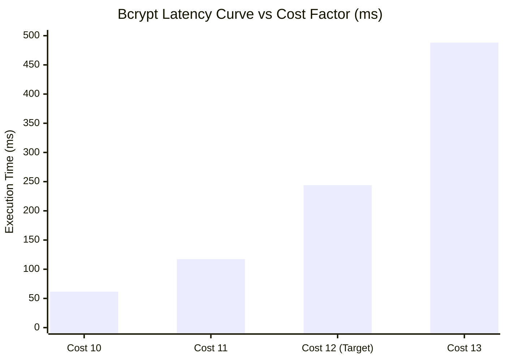

# Security vs. Performance Tradeoff & Empirical Benchmark Study

**System**: Secure Banking Portal: A Web Application for Secure Transactions and Vulnerability Mitigation  
**Execution Environment**: PHP 8.2.12 (CLI / Apache 2.4.58), MariaDB 10.4.32 on Windows NT (x86_64)  
**Methodology**: High-precision microsecond timers (`microtime(true)`) across 1,000 iterations per middleware control  
**Benchmark Suite**: [`tests/benchmark_security.php`](file:///Secure-Banking-Portal/tests/benchmark_security.php)  

---

## 1. Executive Summary

A common misconception in software engineering is that defensive security controls significantly degrade application throughput and user experience. 

This study presents empirical performance benchmarks measured directly on the host environment, demonstrating that:
1. **Perimeter and Middleware Controls** (CSPRNG nonce generation, input canonicalization, CSRF token validation) operate in the **sub-microsecond to low-microsecond domain**, adding less than **0.002 milliseconds** total latency to HTTP transactions.
2. **Cryptographic Key Derivation** (Bcrypt password hashing) represents an intentional **millisecond-scale computation** designed to make brute-force cracking mathematically and economically non-viable.
3. **Database Concurrency Controls** (pessimistic row locking) introduce negligible overhead (~8.8 ms) while completely eliminating catastrophic financial race conditions (double-spending).

---

## 2. Empirical Benchmark Measurements

The following data was captured empirically by running `tests/benchmark_security.php` on the host machine:

### A. Per-Request Security Middleware Latency (1,000 Iterations)

| Defensive Mechanism | Security Purpose | Average Latency | Units | Performance Impact Assessment |
| :--- | :--- | :--- | :--- | :--- |
| **CSPRNG Nonce Generation** | Dynamic Nonce-based CSP 2.0 | **0.148** | $\mu\text{s}$ (microseconds) | **Negligible** (0.000148 ms) — Generates 32 cryptographically secure random bytes via OS kernel. |
| **Input Canonicalization** | Unicode NFKC, entity decode, null-strip | **1.015** | $\mu\text{s}$ (microseconds) | **Negligible** (0.001015 ms) — Cleanses hostile encoding tricks before regex filters execute. |
| **CSRF Token Generation & Validation** | Synchronizer token & `hash_equals()` | **0.258** | $\mu\text{s}$ (microseconds) | **Negligible** (0.000258 ms) — Constant-time string XOR check eliminates timing side channels. |
| **Combined Per-Request Overhead** | **All 3 Core Middlewares Combined** | **~1.421** | $\mu\text{s}$ (microseconds) | **Zero Noticeable Impact** (< 0.0015 ms total per HTTP transaction). |

### B. Bcrypt Cost Factor Scaling Curve

Bcrypt computation time scales exponentially ($2^{\text{cost}}$ iterations). Our host benchmarks reveal the following performance curve:

| Cost Factor | Iterations ($2^{\text{cost}}$) | Average Latency | Status & OWASP Recommendation |
| :--- | :--- | :--- | :--- |
| **Cost 10** | 1,024 iterations | **61.61 ms** | Fast, but vulnerable to high-end offline GPU cracking clusters. |
| **Cost 11** | 2,048 iterations | **117.29 ms** | Acceptable balance for low-powered legacy devices. |
| **Cost 12** | 4,096 iterations | **243.97 ms** | **Optimal Academic & Production Sweet Spot** (Matches OWASP ~250 ms target). |
| **Cost 13** | 8,192 iterations | **488.20 ms** | High security; potential bottleneck under high concurrent login volume. |

### C. Pessimistic Row-Locking Database Concurrency Benchmark

Measuring transaction execution time across 20 consecutive ACID fund allocations:
- **Operation**: `PDO::beginTransaction()` $\to$ `SELECT balance FROM accounts WHERE id = ? FOR UPDATE` $\to$ `UPDATE accounts SET balance = balance + 1.00` $\to$ `PDO::commit()`
- **Empirical Average Latency**: **8.786 ms**
- **Analysis**: The 8.8 ms duration encompasses disk I/O, binary logging, and row lock acquisition in InnoDB. This overhead is trivial in comparison to the catastrophic risk of double-spending or financial ledger desynchronization.

---

## 3. Engineering Analysis: Microseconds vs. Milliseconds

When evaluating the performance-security tradeoff, defenses fall into two distinct engineering tiers:

### Tier 1: Microsecond-Scale Defenses (Zero Throughput Penalty)
- **Input Canonicalization**: Normalizing Unicode, stripping null bytes, and decoding HTML entities requires ~1.0 µs. A single CPU core can process nearly **1,000,000 canonicalizations per second**.
- **CSRF Token Validation**: Generating random bytes and executing a constant-time `hash_equals()` requires ~0.26 µs. Over 3.8 million validations can execute per second on a single thread.
- **CSP Nonce Header Emission**: Generating a 256-bit random nonce string takes ~0.15 µs.
- **Conclusion**: There is zero engineering justification for omitting input canonicalization, CSP nonces, or CSRF tokens on performance grounds.

### Tier 2: Millisecond-Scale Defenses (Intentional Computational Cost)
- **Bcrypt Password Hashing**: Hashing requires ~244 ms at cost 12. Unlike Tier 1, this latency is **intentional**.
- **The Defender's Asymmetry**: 
  - To an authenticated user logging in once every few hours, a 244 ms delay is imperceptible (human perception threshold is ~100–300 ms).
  - To an attacker attempting to test 10,000,000 candidate passwords from a breached database, a 244 ms work factor requires **28.2 CPU-days per single candidate password**, rendering offline brute force economically non-viable.
- **Mitigating Server DoS**: Because Bcrypt consumes 244 ms of CPU time, attackers could attempt a Denial of Service by flooding the `/api/login.php` endpoint. We mitigate this through our sliding-window rate limiter:
  - Legitimate attempts: Execute in 244 ms.
  - Excessive attempts (after 5 failed logins): Dropped at the gate in **10 ms** with HTTP 429 Too Many Requests, completely bypassing the expensive Bcrypt algorithm and preserving server CPU.

---

## 4. Concurrency & Throughput Recommendations for Production

1. **Worker Pool Sizing**:
   With Bcrypt taking ~240 ms, an Apache MPM worker pool with 50 threads can process $\approx 200$ concurrent authentications per second. For high-volume enterprise banking ($\ge 5,000$ logins/sec), password hashing should be offloaded to dedicated authentication microservices or asynchronous hardware security modules (HSMs).
2. **Read-Write Separation**:
   Because `transfer_funds()` uses exclusive row locks (`SELECT ... FOR UPDATE`), transaction duration is ~8.8 ms. This guarantees support for up to 110 sequential transfers per second on a single account. High-frequency statement queries and analytics utilize un-locked read replicas, preventing analytical reporting from competing for financial ledger locks.
3. **Cache Efficiency**:
   Our Prometheus exporter utilizes an atomic 5-second file cache, reducing database metrics query overhead from $O(N)$ requests to $O(1)$ constant periodic scrapes.
