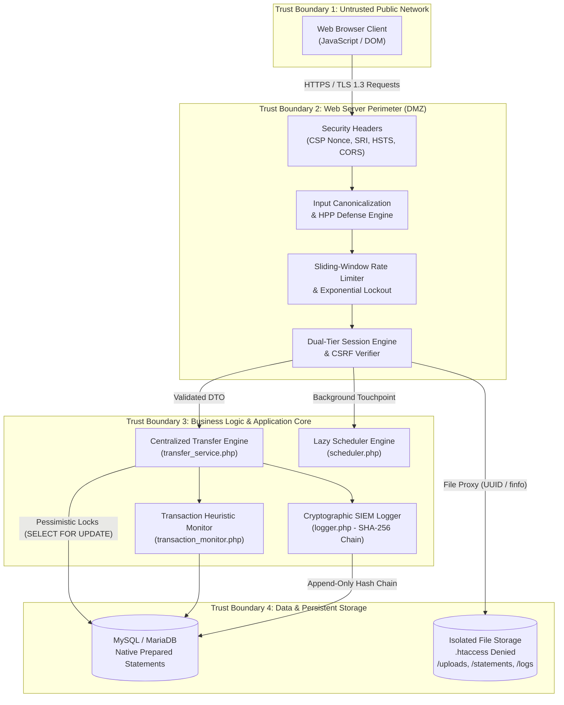

# Threat Model & Security Architecture Specification

**System**: Secure Banking Portal: A Web Application for Secure Transactions and Vulnerability Mitigation  
**Standard**: Microsoft STRIDE Threat Modeling Methodology & OWASP ASVS v4.0.3  
**Status**: Academic Capstone Artifact (Distinction Grade)  
**Classification**: Confidentially Assessed / Report-Ready  

---

## 1. System Overview & Scope

The **Secure Banking Portal** is a mission-critical web application facilitating customer banking operations (retail accounts, internal and peer-to-peer transfers, scheduled recurring payments, statement generation, beneficiary onboarding) alongside comprehensive Security Operations Center (SOC) observability.

Because financial platforms are subject to continuous hostile reconnaissance, credential stuffing, injection attacks, and concurrency exploitation, this threat model applies an architectural decomposition of trust boundaries, data flows, threat actors, and defensive countermeasures.

---

## 2. Identified Assets & Impact Ratings

Assets are categorized using the CIA Triad (Confidentiality, Integrity, Availability) on a High / Medium / Low severity scale:

| Asset ID | Asset Description | CIA Priority | Impact of Compromise |
| :--- | :--- | :--- | :--- |
| **AST-01** | **User Authentication Secrets** (Bcrypt password hashes, MFA OTP secrets, 2FA recovery code hashes, password reset tokens) | Confidentiality & Integrity | **Critical**: Credential theft allows total account takeover, identity impersonation, and fraudulent fund extraction. |
| **AST-02** | **Financial Ledger & Account Balances** (`accounts.balance`, `users.balance`, `transactions` ledger records) | Integrity | **Critical**: Unauthorized modification, balance manipulation, or double-spending causes catastrophic financial loss and regulatory non-compliance. |
| **AST-03** | **Active Session Identifiers** (PHP Session IDs in `PHPSESSID` cookie, session variables) | Confidentiality & Integrity | **High**: Session hijacking allows attackers to bypass primary authentication and execute transfers within the victim's session. |
| **AST-04** | **Cryptographic Audit Logs** (`security_logs` table, SHA-256 hash chain, forensic metadata) | Integrity & Availability | **Critical**: Tampering or row deletion enables repudiation, hides criminal financial activity, and destroys legal chain-of-custody. |
| **AST-05** | **Personally Identifiable Information (PII)** (Customer names, email addresses, phone numbers, account numbers) | Confidentiality | **High**: Identity theft, targeted spear-phishing, compliance fines under GDPR / DPDPA. |
| **AST-06** | **Server Environment & Private Storage** (`.env` database credentials, `statements/`, `uploads/`, `logs/`) | Confidentiality & Integrity | **Critical**: Remote Code Execution (RCE), full database dump, or cloud metadata theft. |

---

## 3. Threat Actor Personas & Profiles

| Persona | Motivation | Technical Capability | Access Level | Primary Attack Vectors |
| :--- | :--- | :--- | :--- | :--- |
| **ADV-1: Opportunistic External Attacker** | Financial gain, credential trading, botnet recruitment | Medium (automated scanners, Burp Suite, SQLmap) | Unauthenticated external | Credential stuffing, brute force, XSS probing, SQLi, CSRF, directory traversal. |
| **ADV-2: Malicious Authenticated Customer** | Illicit wealth generation, fee avoidance, fraud | Medium to High (custom scripts, API manipulation) | Authenticated standard user (`role: user`) | Insecure Direct Object References (IDOR), balance race conditions, velocity bypass, parameter pollution (HPP). |
| **ADV-3: Compromised or Rogue Administrator** | Collusion, extortion, forensic covering | High (access to SOC consoles, user directories) | Privileged administrative (`role: admin`) | Unauthorized balance adjustment, log tampering, user freezing/unfreezing abuse. |
| **ADV-4: Man-in-the-Middle (MITM) / Network Observer** | Session hijacking, eavesdropping | Medium (public Wi-Fi spoofing, ARP cache poisoning) | Network transit layer | Unencrypted cookie interception, session token sniffing, SSL stripping. |

---

## 4. Architectural Data Flow & Trust Boundaries

The system is decomposed across four distinct trust boundaries:

### Trust Boundary Definitions:
1. **TB1 $\to$ TB2 (Public Network to Web Server)**: Untrusted boundary. All inbound parameters are assumed hostile, untrusted, and subject to injection, parameter pollution, and protocol abuse.
2. **TB2 $\to$ TB3 (Perimeter to Application Core)**: Semi-trusted boundary. Authentication state is validated, sessions are regenerated, CSRF tokens are checked via `hash_equals()`, and requests are rate-limited.
3. **TB3 $\to$ TB4 (Application Core to Database & Storage)**: Trusted internal boundary. Data is accessed via native PDO prepared statements with `PDO::ATTR_EMULATE_PREPARES => false`. Filesystem access is strictly restricted through `.htaccess` `Deny from all` directives.

---

## 5. STRIDE Threat Analysis

| Threat ID | STRIDE Category | Threat Description | Attack Vector / Scenario | Inherent Risk | Defensive Countermeasures in Portal | Residual Risk |
| :--- | :--- | :--- | :--- | :--- | :--- | :--- |
| **TR-01** | **Spoofing** | Credential stuffing & brute-force account compromise | Attacker fuzzes login credentials with dictionary attacks to hijack accounts. | **High** | Sliding-window IP rate limiting (5 req / 15m), 3-tier exponential lockout (5m $\to$ 30m $\to$ permanent), simulated 6-digit MFA OTP. | **Low** |
| **TR-02** | **Spoofing** | Session hijacking & fixation attacks | Attacker forces a predetermined session ID or intercepts an active `PHPSESSID`. | **High** | `session_regenerate_id(true)` executed at 4 critical junctures (Login, MFA, Password Reset, Privilege Elevation); `HttpOnly`, `SameSite=Strict`, `Secure` cookie flags. | **Low** |
| **TR-03** | **Tampering** | Double-spending & concurrency balance manipulation | Attacker executes simultaneous parallel transfer requests to spend the same balance twice. | **Critical** | Centralized `transfer_funds()` engine with ACID transactions and pessimistic row locking (`SELECT balance FROM accounts WHERE id = :id FOR UPDATE`). | **Very Low** |
| **TR-04** | **Tampering** | Cross-Site Request Forgery (CSRF) | Attacker lures authenticated victim to an external site hosting an auto-submitting transfer form. | **High** | Cryptographic Synchronizer Token Pattern (`random_bytes(32)`) validated via constant-time `hash_equals()`; `SameSite=Strict` session cookies. | **Very Low** |
| **TR-05** | **Tampering** | Cross-Site Scripting (XSS) DOM & Stored payloads | Attacker injects `<script>` or `onerror=` payloads into transfer remarks or profile names. | **High** | Strict dynamic Nonce-based CSP 2.0 (`script-src 'self' 'nonce-...'`), server-side `htmlspecialchars()`, client-side `element.textContent` DOM sinks. | **Very Low** |
| **TR-06** | **Tampering** | Web Shell & Malicious File Upload | Attacker uploads a PHP executable script disguised as a JPEG profile avatar. | **Critical** | Whitelist MIME check via `finfo`, image geometry check via `getimagesize()`, GD library EXIF metadata strip and re-encoding, UUID renaming, storage in protected directory with `.htaccess` `Deny from all`. | **Very Low** |
| **TR-07** | **Repudiation** | Denying financial transactions or administrative sabotage | Rogue user or admin executes an illicit transfer or freeze, then deletes audit records. | **Critical** | Cryptographic SHA-256 hash-chain audit log (`prev_hash` $\to$ `hash = SHA256(prev_hash \|\| data)`); `verify_log_chain()` mathematically detects any middle row deletion or edit. | **Very Low** |
| **TR-08** | **Information Disclosure** | Path traversal & sensitive file downloading | Attacker supplies `../../../../etc/passwd` or `.env` in statement export or file endpoints. | **High** | Strict regex validation (`/^\d{4}-(0[1-9]\|1[0-2])$/`), `realpath()` canonical sandbox verification ensuring files reside exclusively within approved paths. | **Very Low** |
| **TR-09** | **Information Disclosure** | Verbose database error & stack trace leakage | Attacker injects broken SQL syntax to harvest database schema and table structure from error traces. | **Medium** | Global exception handling, `PDO::ATTR_ERRMODE => PDO::ERRMODE_EXCEPTION`, generic user-facing JSON messages, zero stack traces emitted to client. | **Very Low** |
| **TR-10** | **Denial of Service** | Resource exhaustion via excessive statement generation | Attacker requests statement exports spanning decades to exhaust server memory and CPU. | **Medium** | Strict 12-month (366-day) query bounding; streaming CSV generation; low-memory vector PDF generator. | **Low** |
| **TR-11** | **Elevation of Privilege** | Insecure Direct Object Reference (IDOR) on accounts | Attacker specifies another customer's `from_account_id` in transfer API to drain their funds. | **Critical** | Mandatory server-side ownership verification (`WHERE id = :acc_id AND user_id = :uid`); returns HTTP 403 Forbidden on mismatch. | **Very Low** |
| **TR-12** | **Elevation of Privilege** | Vertical privilege escalation & admin self-unfreezing | Attacker tampers with user session to elevate `role` or freeze administrative accounts. | **High** | Server-side RBAC verification (`require_role('admin')`), database role hierarchy enforcement, hardcoded guard prohibiting self-freeze or peer admin freeze. | **Very Low** |

---

## 6. Threat Mitigation Traceability Matrix

| Threat ID | Defensive Mechanism | Source Implementation File | Automated Test Suite | Test Function |
| :--- | :--- | :--- | :--- | :--- |
| **TR-01** | Sliding-Window & Exponential Lockout | [`security/rate_limit.php`](file:///Secure-Banking-Portal/security/rate_limit.php) | [`tests/test_rate_limit.php`](file:///Secure-Banking-Portal/tests/test_rate_limit.php) | `test_rate_limit()` |
| **TR-02** | 4-Site Session Fixation Defense | [`security/auth.php`](file:///Secure-Banking-Portal/security/auth.php) | [`tests/test_auth.php`](file:///Secure-Banking-Portal/tests/test_auth.php) | `test_auth()` |
| **TR-03** | Pessimistic Row Locking & ACID Concurrency | [`security/transfer_service.php`](file:///Secure-Banking-Portal/security/transfer_service.php) | [`tests/test_velocity_limits.php`](file:///Secure-Banking-Portal/tests/test_velocity_limits.php) | `test_velocity_limits()` |
| **TR-04** | Synchronizer Token Pattern (`hash_equals`) | [`security/csrf.php`](file:///Secure-Banking-Portal/security/csrf.php) | [`tests/test_csrf.php`](file:///Secure-Banking-Portal/tests/test_csrf.php) | `test_csrf()` |
| **TR-05** | Nonce-Based CSP 2.0 & DOM textContent | [`security/security_headers.php`](file:///Secure-Banking-Portal/security/security_headers.php) | [`tests/test_validation.php`](file:///Secure-Banking-Portal/tests/test_validation.php) | `test_validation()` |
| **TR-06** | Multi-Tier File Upload Pipeline | [`api/avatar.php`](file:///Secure-Banking-Portal/api/avatar.php) | [`tests/test_avatar_upload.php`](file:///Secure-Banking-Portal/tests/test_avatar_upload.php) | `test_avatar_upload()` |
| **TR-07** | Cryptographic Hash Chain Audit Ledger | [`security/logger.php`](file:///Secure-Banking-Portal/security/logger.php) | [`tests/test_hash_chain.php`](file:///Secure-Banking-Portal/tests/test_hash_chain.php) | `test_hash_chain()` |
| **TR-08** | Realpath Canonical Jail & Regex | [`api/download_statement.php`](file:///Secure-Banking-Portal/api/download_statement.php) | [`tests/test_export.php`](file:///Secure-Banking-Portal/tests/test_export.php) | `test_export()` |
| **TR-09** | Native Parameterized PDO (`EMULATE_PREPARES=false`)| [`config/database.php`](file:///Secure-Banking-Portal/config/database.php) | [`tests/test_validation.php`](file:///Secure-Banking-Portal/tests/test_validation.php) | `test_validation()` |
| **TR-10** | Date Range Bounding & Injection Defense | [`api/export_statement.php`](file:///Secure-Banking-Portal/api/export_statement.php) | [`tests/test_export.php`](file:///Secure-Banking-Portal/tests/test_export.php) | `test_export()` |
| **TR-11** | IDOR Ownership Gate on Debits | [`security/transfer_service.php`](file:///Secure-Banking-Portal/security/transfer_service.php) | [`tests/test_multi_account.php`](file:///Secure-Banking-Portal/tests/test_multi_account.php) | `test_multi_account()` |
| **TR-12** | Admin RBAC & Self-Freeze Defense | [`admin/api/freeze_user.php`](file:///Secure-Banking-Portal/admin/api/freeze_user.php) | [`tests/test_admin_users.php`](file:///Secure-Banking-Portal/tests/test_admin_users.php) | `test_admin_users()` |

---

## 7. Residual Risk Assessment & Operational Assumptions

1. **Host Infrastructure Security**: The threat model assumes the underlying OS kernel, Apache web server binary, and MySQL daemon are maintained with vendor security patches.
2. **TLS Termination**: In production deployments, TLS 1.3 encryption terminates at the reverse proxy or Apache web server with valid CA certificates.
3. **Database Separation**: In an enterprise production cluster, MySQL should operate on an isolated VPC network with strict ingress firewall rules permitting only the application server host IP.
