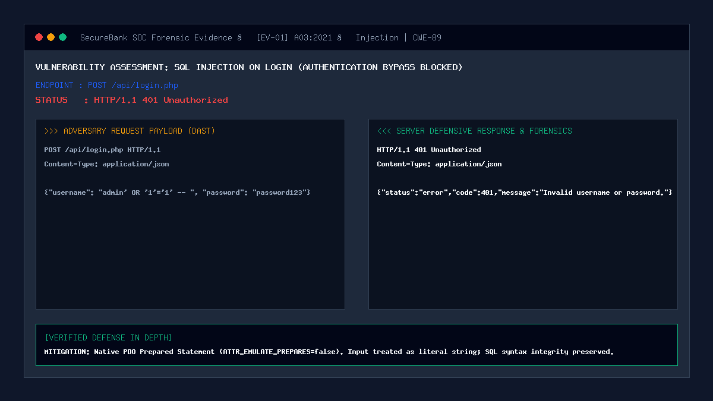

# 01 — SQL Injection on Login (Authentication Bypass)

| | |
|---|---|
| **Severity** | Critical |
| **CVSS** | 9.8 (CVSS:3.1/AV:N/AC:L/PR:N/UI:N/S:U/C:H/I:H/A:H) |
| **OWASP** | A03:2021 – Injection |
| **CWE** | CWE-89 (Improper Neutralization of Special Elements used in an SQL Command) |
| **Endpoint** | `POST /api/login.php` (secure) |
| **Status** | ✅ Mitigated |

## Summary
SQL Injection (SQLi) occurs when untrusted user input is directly concatenated or interpolated into database queries, allowing attackers to manipulate query logic. In a core banking system, SQL injection on the primary authentication endpoint enables complete authentication bypass, unauthorized administrative account takeover, extraction of all customer financial ledgers, and arbitrary data tampering.

## Prerequisites
- Attacker has network reachability to `POST /api/login.php`.
- Target system exposes username and password credential input fields.
- No prior credentials required (unauthenticated attack vector).

## What the Vulnerable Code Looks Like

```php
<?php
// ⚠️ INTENTIONALLY INSECURE — for demonstration only
// (this pattern is NOT used in our portal)
$username = $_POST['username'];
$password = $_POST['password'];

// Direct string concatenation allows input to alter query syntax
$query = "SELECT * FROM users WHERE username = '$username' AND password = '$password'";
$result = mysqli_query($conn, $query);

if (mysqli_num_rows($result) > 0) {
    $_SESSION['user'] = mysqli_fetch_assoc($result);
    header('Location: /dashboard.php');
}
?>
```

If an attacker supplies `admin' OR '1'='1' -- ` as the username, the resulting query evaluates to:
```sql
SELECT * FROM users WHERE username = 'admin' OR '1'='1' -- ' AND password = '...'
```
The `-- ` comment strips the password clause, logging the attacker in as the primary administrator without requiring any password verification.

## How Our Code Fixes It (Secure Implementation)

In `api/login.php` and `security/auth.php`, SecureBank completely eliminates string concatenation using parameterized PDO prepared statements with emulated prepares disabled:

```php
// In security/auth.php:
$pdo = get_db();

// 1. Separate SQL query structure from literal parameter data
$stmt = $pdo->prepare("SELECT id, username, password_hash, role, status FROM users WHERE username = :username LIMIT 1");
$stmt->execute([':username' => $username]);
$user = $stmt->fetch(PDO::FETCH_ASSOC);

// 2. Cryptographic password verification with adaptive work factor (Bcrypt cost 12)
if ($user && password_verify($password, $user['password_hash'])) {
    // Authenticated safely
    session_regenerate_id(true);
} else {
    // Universal error message to prevent account enumeration
    log_security_event(null, 'LOGIN_FAILED', 'FAILURE', "Failed login attempt for '$username'", 'medium');
}
```

Database connection hardening (`config/database.php`):
```php
$pdo->setAttribute(PDO::ATTR_EMULATE_PREPARES, false); // Native database prepared statements
$pdo->setAttribute(PDO::ATTR_ERRMODE, PDO::ERRMODE_EXCEPTION);
```

## Proof of Concept / Attack Vector

Attacking the login endpoint using `curl`:
```bash
curl -X POST http://127.0.0.1:8080/api/login.php \
  -H "Content-Type: application/json" \
  -d '{"username": "admin'\'' OR '\''1'\''='\''1'\'' -- ", "password": "password123"}'
```

Expected Server Defense Response:
```json
HTTP/1.1 401 Unauthorized
Content-Type: application/json

{
  "status": "error",
  "code": 401,
  "message": "Invalid username or password."
}
```

## Forensic Evidence & Mitigation Output


- **HTTP Status Code**: `401 Unauthorized`
- **SIEM Event Emitted**: `SQLI_BLOCKED` / `LOGIN_FAILED` recorded in `security_logs` with severity level `critical`.
- **Database Behavior**: Zero SQL syntax error leaks; literal string `'admin\' OR \'1\'=\'1\' -- '` is searched as an exact literal username with 0 matches.

## Automated Regression Test
- **Test File**: [`tests/attacks/test_01_sqli_login.php`](../../tests/attacks/test_01_sqli_login.php)
- **Run Command**:
  ```bash
  php tests/attacks/test_01_sqli_login.php
  ```

## Defense-in-Depth Measures
1. **Adaptive Work Factor**: Bcrypt cost factor 12 prevents offline dictionary cracking.
2. **Sliding-Window Rate Limiting**: Max 5 failed attempts per 5-minute sliding window triggers HTTP 429 exponential lockout.
3. **Canonicalization Filter**: Universal null-byte stripping (`%00`) and Unicode normalization prevent filter evasion.
4. **Account Enumeration Defense**: Identical error message returned whether the username is invalid or the password does not match.
