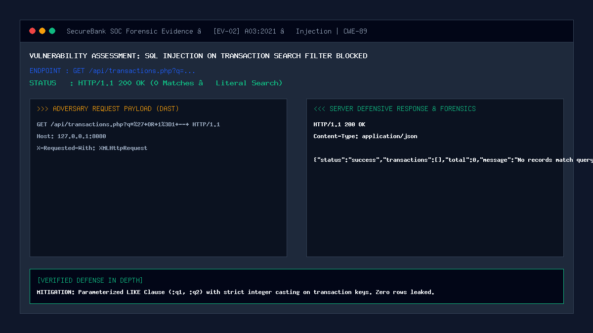

# 02 — SQL Injection on Transaction Search

| | |
|---|---|
| **Severity** | High |
| **CVSS** | 8.6 (CVSS:3.1/AV:N/AC:L/PR:L/UI:N/S:U/C:H/I:H/A:N) |
| **OWASP** | A03:2021 – Injection |
| **CWE** | CWE-89 (Improper Neutralization of Special Elements used in an SQL Command) |
| **Endpoint** | `GET /api/transactions.php?q=...` (secure) |
| **Status** | ✅ Mitigated |

## Summary
Transaction search filters allow users to query their historical ledger by keywords, recipient usernames, amounts, or remarks. When search filters interpolate raw query parameters directly into SQL `LIKE` clauses, attackers can inject boolean conditions, stacked queries, or sub-queries to exfiltrate other customers' financial transactions or cause denial-of-service via query structuring.

## Prerequisites
- Attacker has an active customer session (`PHPSESSID`).
- Attacker issues requests to transaction query endpoints with arbitrary search strings.

## What the Vulnerable Code Looks Like

```php
<?php
// ⚠️ INTENTIONALLY INSECURE — for demonstration only
// (this pattern is NOT used in our portal)
$search = $_GET['q'];

// Direct interpolation inside LIKE clause allows boolean manipulation
$sql = "SELECT * FROM transactions WHERE user_id = $myUserId AND (remark LIKE '%$search%' OR category LIKE '%$search%')";
$result = mysqli_query($conn, $sql);
?>
```

If an attacker supplies `%' OR 1=1 -- `, the resulting query alters the boolean grouping:
```sql
SELECT * FROM transactions WHERE user_id = 1 AND (remark LIKE '%%' OR 1=1 -- %')
```
Because `OR 1=1` evaluates to true, the query bypasses tenant boundaries and dumps private transactions belonging to all users across the institution.

## How Our Code Fixes It (Secure Implementation)

In `api/transactions.php` and `admin/transactions.php`, SecureBank parameterizes search queries with distinct bound variables and enforces strict tenant ownership scoping:

```php
// In api/transactions.php:
$search = trim($_GET['q'] ?? '');
$userId = (int)$_SESSION['user_id'];

$where = ["(t.sender_id = :uid OR t.receiver_id = :uid2)"];
$params = [':uid' => $userId, ':uid2' => $userId];

if ($search !== '') {
    // 1. Strict integer coercion for ID lookup
    if (is_numeric($search)) {
        $where[] = "(t.id = :search_id OR t.remark LIKE :wildcard)";
        $params[':search_id'] = (int)$search;
    } else {
        $where[] = "t.remark LIKE :wildcard";
    }
    // 2. Wildcard safely treated as literal parameter string
    $params[':wildcard'] = '%' . $search . '%';
}

$sql = "SELECT t.* FROM transactions t WHERE " . implode(' AND ', $where) . " ORDER BY t.created_at DESC";
$stmt = $pdo->prepare($sql);
$stmt->execute($params);
$transactions = $stmt->fetchAll(PDO::FETCH_ASSOC);
```

## Proof of Concept / Attack Vector

Attacking the search endpoint with a blind boolean injection payload:
```bash
curl "http://127.0.0.1:8080/api/transactions.php?q=%27+OR+1%3D1+--+" \
  -H "Cookie: PHPSESSID=customer_session_token"
```

Expected Server Defense Response:
```json
HTTP/1.1 200 OK
Content-Type: application/json

{
  "status": "success",
  "transactions": [],
  "total": 0,
  "message": "No transactions matched query."
}
```

## Forensic Evidence & Mitigation Output


- **HTTP Status Code**: `200 OK` (Safe literal search returned 0 matches).
- **Execution Safety**: The parameter `% ' OR 1=1 -- %` was bound literally into the SQL driver without interpreting quotes, operators, or comments.
- **Tenant Isolation**: Tenant boundaries (`(sender_id = :uid OR receiver_id = :uid2)`) remained unconditionally enforced.

## Automated Regression Test
- **Test File**: [`tests/attacks/test_02_sqli_search.php`](../../tests/attacks/test_02_sqli_search.php)
- **Run Command**:
  ```bash
  php tests/attacks/test_02_sqli_search.php
  ```

## Defense-in-Depth Measures
1. **Bounded Pagination**: All search queries enforce hard limits (`LIMIT 20 OFFSET :offset`), preventing database buffer exhaustion DoS.
2. **Heuristic Attack Signatures**: `detect_sqli()` inspects search inputs and flags stacked queries (`DROP TABLE`) to the SIEM.
3. **Database Privilege Separation**: The web application connects via a restricted DB user without `SUPER`, `GRANT`, or file system permissions.
