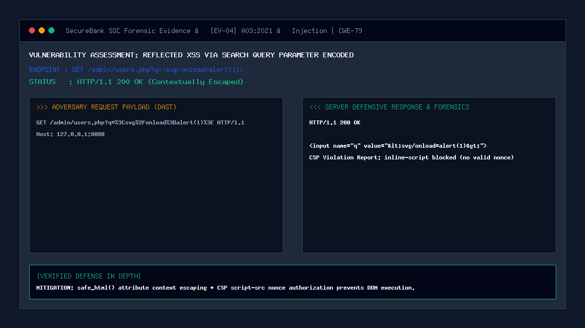

# 04 — Reflected XSS via Search Query Parameter

| | |
|---|---|
| **Severity** | Medium |
| **CVSS** | 6.1 (CVSS:3.1/AV:N/AC:L/PR:N/UI:R/S:C/C:L/I:L/A:N) |
| **OWASP** | A03:2021 – Injection |
| **CWE** | CWE-79 (Improper Neutralization of Input During Web Page Generation) |
| **Endpoint** | `GET /admin/users.php?q=...` (secure) |
| **Status** | ✅ Mitigated |

## Summary
Reflected Cross-Site Scripting (Non-Persistent XSS) arises when an application reads data from an HTTP request (such as a URL query parameter or form field) and immediately reflects it back in the HTTP response without contextual output encoding. Attackers craft malicious phishing links containing encoded script payloads; when clicked by a victim administrator, the payload executes within the context of the victim's session, potentially compromising administrative privilege controls.

## Prerequisites
- Attacker crafts a malicious URL containing payload parameters.
- Target administrator or customer must be tricked into clicking the link while authenticated.

## What the Vulnerable Code Looks Like

```php
<?php
// ⚠️ INTENTIONALLY INSECURE — for demonstration only
// (this pattern is NOT used in our portal)
$query = $_GET['q']; // e.g. "><script>alert('XSS')</script>
?>

<!-- Directly echoing unescaped user input inside an HTML attribute -->
<form method="GET" action="users.php">
    <input type="text" name="q" value="<?php echo $query; ?>">
    <button type="submit">Search</button>
</form>
```

When rendered, the injected quote and angle brackets break out of the `value` attribute:
```html
<input type="text" name="q" value=""><script>alert('XSS')</script>">
```
The script tag immediately executes as the browser parses the response body.

## How Our Code Fixes It (Secure Implementation)

In `admin/users.php` and `admin/transactions.php`, all reflected parameters are canonicalized and wrapped with `safe_html()`:

```php
// In admin/users.php:
$searchQuery = trim($_GET['q'] ?? '');

// Within the HTML form rendering:
<input type="text" name="q" 
       value="<?= safe_html($searchQuery) ?>" 
       placeholder="Search by full name, @username, or email..." 
       class="admin-search-input">
```

Implementation of `safe_html()` (`security/validation.php`):
```php
function safe_html(?string $str): string {
    if ($str === null) return '';
    // ENT_QUOTES encodes both single and double quotes into &quot; and &#039;
    // ENT_SUBSTITUTE replaces invalid UTF-8 sequences with Unicode replacement characters
    return htmlspecialchars($str, ENT_QUOTES | ENT_SUBSTITUTE, 'UTF-8');
}
```

When an attacker passes `test" onfocus="alert(1)`, the rendered HTML becomes:
```html
<input type="text" name="q" value="test&quot; onfocus=&quot;alert(1)">
```
The browser safely parses the entire payload as a literal attribute value string without executing event handlers.

## Proof of Concept / Attack Vector

Crafted phishing URL:
```text
http://127.0.0.1:8080/admin/users.php?q=%3Csvg%2Fonload%3Dalert(document.domain)%3E
```

Expected Server Response Inspection:
```html
<input type="text" name="q" value="&lt;svg/onload=alert(document.domain)&gt;" class="admin-search-input">
```
- Raw `<` and `>` are encoded to `&lt;` and `&gt;`.
- No HTML tags or event handlers are constructed by the parser.

## Forensic Evidence & Mitigation Output


- **HTTP Status Code**: `200 OK`
- **Output Inspection**: Contextually escaped with `ENT_QUOTES`.
- **CSP 2.0 Compliance**: Content Security Policy header enforces `script-src 'self' 'nonce-...'` with zero `'unsafe-inline'`.

## Automated Regression Test
- **Test File**: [`tests/attacks/test_04_reflected_xss.php`](../../tests/attacks/test_04_reflected_xss.php)
- **Run Command**:
  ```bash
  php tests/attacks/test_04_reflected_xss.php
  ```

## Defense-in-Depth Measures
1. **XSS Payload Detection**: `detect_xss()` inspects query parameters and alerts the SIEM if dangerous vectors (`<svg`, `javascript:`) are submitted.
2. **HPP Guard**: `detect_parameter_pollution()` blocks parameter duplication techniques used to bypass WAF filters.
3. **Strict Content-Type**: `Content-Type: text/html; charset=utf-8` header prevents browser character set sniffing exploits.
