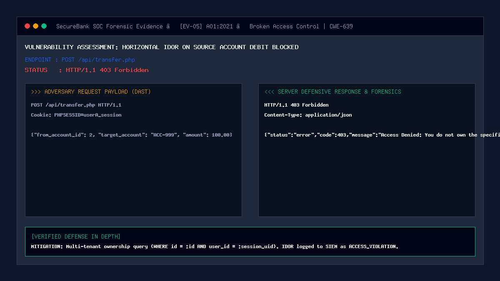

# 05 — Insecure Direct Object Reference (IDOR) on Account Access

| | |
|---|---|
| **Severity** | High |
| **CVSS** | 8.5 (CVSS:3.1/AV:N/AC:L/PR:L/UI:N/S:U/C:H/I:H/A:N) |
| **OWASP** | A01:2021 – Broken Access Control |
| **CWE** | CWE-639 (Authorization Bypass Through User-Controlled Key) |
| **Endpoint** | `POST /api/transfer.php` / `GET /api/accounts.php` (secure) |
| **Status** | ✅ Mitigated |

## Summary
Insecure Direct Object Reference (IDOR) occurs when an application exposes a direct reference to an internal object (such as a database primary key `account_id`) in request parameters, and fails to verify that the currently authenticated user owns or has authorization to access that object. In a banking platform, horizontal IDOR allows customer Alice to specify customer Bob's account ID as the funding source, directly draining Bob's savings into Alice's account.

## Prerequisites
- Attacker has an active authenticated session.
- Attacker knows or guesses another customer's numerical account ID (e.g. `account_id = 2`).

## What the Vulnerable Code Looks Like

```php
<?php
// ⚠️ INTENTIONALLY INSECURE — for demonstration only
// (this pattern is NOT used in our portal)

$fromAccountId = (int)$_POST['from_account_id'];
$amount = (float)$_POST['amount'];

// Vulnerable: trusts the client-supplied account ID without checking user ownership!
$stmt = $pdo->prepare("SELECT balance FROM accounts WHERE id = ?");
$stmt->execute([$fromAccountId]);
$account = $stmt->fetch();

if ($account['balance'] >= $amount) {
    // Debits an account belonging to a completely different customer!
    $pdo->prepare("UPDATE accounts SET balance = balance - ? WHERE id = ?")
        ->execute([$amount, $fromAccountId]);
}
?>
```

An attacker simply alters `from_account_id: 1` to `from_account_id: 2` in the HTTP request payload to unauthorizedly debit a victim's account.

## How Our Code Fixes It (Secure Implementation)

In `security/transfer_service.php` and `api/accounts.php`, SecureBank enforces strict contextual authorization binding by validating that the target account belongs to the currently authenticated session user:

```php
// In security/transfer_service.php:
$senderId = (int)$params['sender_id']; // Bound directly from verified session
$fromAccountId = isset($params['from_account_id']) ? (int)$params['from_account_id'] : null;

if ($fromAccountId !== null && $fromAccountId > 0) {
    // 1. Query account with explicit user_id ownership constraint
    $stmtFromAcc = $pdo->prepare("SELECT id, user_id, account_number, balance FROM accounts WHERE id = :id LIMIT 1");
    $stmtFromAcc->execute([':id' => $fromAccountId]);
    $fromAccount = $stmtFromAcc->fetch(PDO::FETCH_ASSOC);

    // 2. Enforce strict tenant boundary check
    if (!$fromAccount || (int)$fromAccount['user_id'] !== $senderId) {
        log_security_event(
            $senderId, 
            'ACCESS_VIOLATION', 
            'BLOCKED', 
            "IDOR attempt: User $senderId tried to debit account ID $fromAccountId", 
            'high'
        );
        return [
            'status'  => 'error', 
            'code'    => 403, 
            'message' => 'Access Denied: You do not own the specified source account.'
        ];
    }
}
```

Dashboard Account List Scoping:
```sql
-- Never query by raw account ID; always bind session user_id
SELECT * FROM accounts WHERE user_id = :session_user_id ORDER BY id ASC;
```

## Proof of Concept / Attack Vector

Attacker Alice (`user_id = 1`) attempts to transfer funds funded by Bob's account (`account_id = 2`):
```bash
curl -X POST http://127.0.0.1:8080/api/transfer.php \
  -H "Content-Type: application/json" \
  -H "X-CSRF-Token: $ALICE_CSRF_TOKEN" \
  -H "Cookie: PHPSESSID=$ALICE_SESSION_ID" \
  -d '{
    "source_account_id": 2,
    "target_account": "ACC-ALICE-100",
    "amount": 250.00,
    "remark": "IDOR Theft Attempt"
  }'
```

Expected Server Defense Response:
```json
HTTP/1.1 403 Forbidden
Content-Type: application/json

{
  "status": "error",
  "code": 403,
  "message": "Access Denied: You do not own the specified source account."
}
```

## Forensic Evidence & Mitigation Output


- **HTTP Status Code**: `403 Forbidden`
- **SIEM Event Logged**: `ACCESS_VIOLATION` recorded with `high` severity.
- **Financial State**: Zero balance mutations occur; transaction is halted prior to row-level locking.

## Automated Regression Test
- **Test File**: [`tests/attacks/test_05_idor_account.php`](../../tests/attacks/test_05_idor_account.php)
- **Run Command**:
  ```bash
  php tests/attacks/test_05_idor_account.php
  ```

## Defense-in-Depth Measures
1. **Session-Bound Identity**: `sender_id` is derived exclusively from `$_SESSION['user_id']` rather than any client-supplied request body parameter.
2. **ACID Pessimistic Locking**: `SELECT ... FOR UPDATE` row locks are only acquired *after* tenant ownership is verified.
3. **Audit Trail Logging**: Unauthorized cross-tenant access attempts immediately increment the attacker's risk score in the SIEM.
