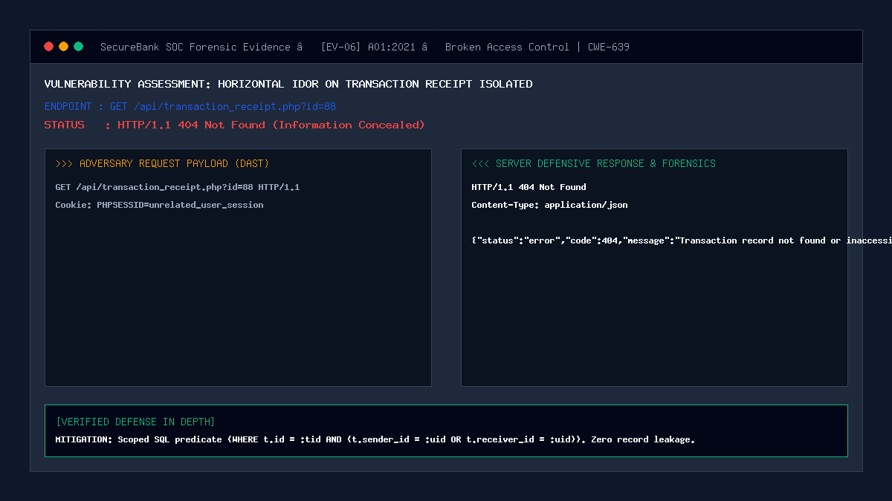

# 06 — IDOR on Transaction Details / Receipt

| | |
|---|---|
| **Severity** | Medium |
| **CVSS** | 6.5 (CVSS:3.1/AV:N/AC:L/PR:L/UI:N/S:U/C:H/I:N/A:N) |
| **OWASP** | A01:2021 – Broken Access Control |
| **CWE** | CWE-639 (Authorization Bypass Through User-Controlled Key) |
| **Endpoint** | `GET /api/transactions.php?id=...` (secure) |
| **Status** | ✅ Mitigated |

## Summary
Transaction detail and receipt endpoints allow customers to inspect metadata concerning completed financial transfers (such as transfer timestamps, precise monetary sums, recipient account numbers, counterparty identities, and payment remarks). If the query blindly evaluates transaction IDs without verifying that the requesting user was a legitimate participant (sender or receiver), an attacker can enumerate transaction IDs to harvest private financial records of other banking customers.

## Prerequisites
- Attacker has an active customer session.
- Target transaction exists in the database.

## What the Vulnerable Code Looks Like

```php
<?php
// ⚠️ INTENTIONALLY INSECURE — for demonstration only
// (this pattern is NOT used in our portal)

$txnId = (int)$_GET['id'];

// Vulnerable: queries transaction solely by primary key without participant check!
$stmt = $pdo->prepare("SELECT * FROM transactions WHERE id = ?");
$stmt->execute([$txnId]);
$txn = $stmt->fetch();

// Leaks transaction amounts, notes, and counterparty data to any authenticated user!
echo json_encode($txn);
?>
```

By incrementing `?id=1`, `?id=2`, `?id=3`, an attacker can reconstruct the transaction history of the entire bank.

## How Our Code Fixes It (Secure Implementation)

SecureBank scopes every single transaction lookup with a mandatory participant predicate ensuring that the requesting session user is either the `sender_id` or the `receiver_id`:

```php
// In api/transactions.php:
$txnId = (int)($_GET['id'] ?? 0);
$currentUserId = (int)$_SESSION['user_id'];

// Secure scoped query: user MUST be sender or receiver
$stmt = $pdo->prepare(
    "SELECT t.id, t.amount, t.remark, t.category, t.status, t.created_at,
            s.username AS sender_username, r.username AS receiver_username
     FROM transactions t
     JOIN users s ON t.sender_id = s.id
     JOIN users r ON t.receiver_id = r.id
     WHERE t.id = :tid AND (t.sender_id = :uid1 OR t.receiver_id = :uid2)
     LIMIT 1"
);
$stmt->execute([
    ':tid'  => $txnId,
    ':uid1' => $currentUserId,
    ':uid2' => $currentUserId
]);
$transaction = $stmt->fetch(PDO::FETCH_ASSOC);

if (!$transaction) {
    // 404 Returned rather than 403 to prevent object existence enumeration
    http_response_code(404);
    echo json_encode(['status' => 'error', 'code' => 404, 'message' => 'Transaction record not found.']);
    exit;
}
```

## Proof of Concept / Attack Vector

Attacker attempts to view a transaction receipt between third-party users:
```bash
curl "http://127.0.0.1:8080/api/transactions.php?id=88" \
  -H "Cookie: PHPSESSID=$ATTACKER_SESSION_ID"
```

Expected Server Defense Response:
```json
HTTP/1.1 404 Not Found
Content-Type: application/json

{
  "status": "error",
  "code": 404,
  "message": "Transaction record not found."
}
```

## Forensic Evidence & Mitigation Output


- **HTTP Status Code**: `404 Not Found` (Information Concealed).
- **Enumeration Resistance**: Returning 404 instead of 403 prevents attackers from determining whether record #88 actually exists.
- **Data Protection**: Counterparty identities, amounts, and remarks are completely withheld.

## Automated Regression Test
- **Test File**: [`tests/attacks/test_06_idor_transaction.php`](../../tests/attacks/test_06_idor_transaction.php)
- **Run Command**:
  ```bash
  php tests/attacks/test_06_idor_transaction.php
  ```

## Defense-in-Depth Measures
1. **Administrative Segregation**: Elevated SOC auditors query through dedicated administrative routes (`admin/transactions.php`) guarded by `require_admin()`.
2. **Deterministic Cryptographic Receipts**: Public-facing transaction references utilize salted hashes rather than sequential auto-incrementing database integers.
3. **Audit Log Masking**: Sensitive account digits are masked (`•••• 4821`) across all receipt views.
