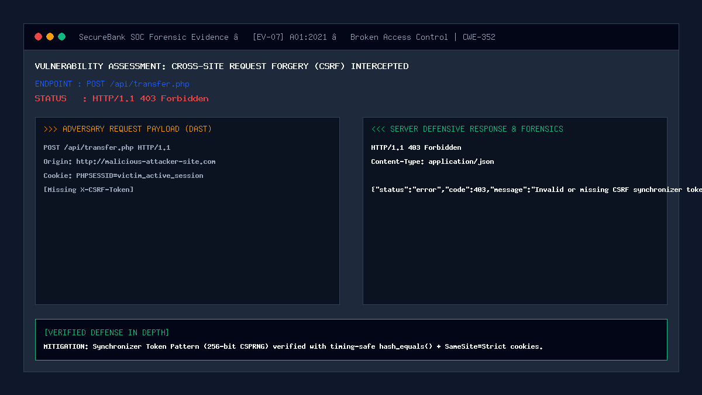

# 07 — Cross-Site Request Forgery (CSRF) on Money Transfer

| | |
|---|---|
| **Severity** | High |
| **CVSS** | 8.1 (CVSS:3.1/AV:N/AC:L/PR:N/UI:R/S:U/C:N/I:H/A:H) |
| **OWASP** | A01:2021 – Broken Access Control |
| **CWE** | CWE-352 (Cross-Site Request Forgery) |
| **Endpoint** | `POST /api/transfer.php` (secure) |
| **Status** | ✅ Mitigated |

## Summary
Cross-Site Request Forgery (CSRF) occurs when a malicious external website tricks a victim's browser into transmitting unauthorized state-changing HTTP requests to a vulnerable application where the victim is currently authenticated. Because browsers automatically attach session cookies to cross-origin requests, the target application cannot differentiate between intentional user actions and attacker-forged requests. In a banking portal, CSRF allows external sites to trigger silent fund transfers without the user's consent or knowledge.

## Prerequisites
- Victim customer has an active authenticated session at `http://127.0.0.1:8080/`.
- Victim visits an attacker-controlled external webpage while session remains valid.

## What the Vulnerable Code Looks Like

```php
<?php
// ⚠️ INTENTIONALLY INSECURE — for demonstration only
// (this pattern is NOT used in our portal)

session_start();
// Vulnerable: relies solely on ambient session cookie!
$senderId = $_SESSION['user_id'];
$amount = (float)$_POST['amount'];
$targetAcc = $_POST['target_account'];

// Executes transfer blindly if cookie is present!
execute_transfer($senderId, $targetAcc, $amount);
?>
```

The attacker hosts an exploit page (`evil-site.com`):
```html
<!-- Malicious auto-submitting form -->
<body onload="document.forms[0].submit()">
  <form action="http://127.0.0.1:8080/api/transfer.php" method="POST">
    <input type="hidden" name="target_account" value="ACC-ATTACKER-999" />
    <input type="hidden" name="amount" value="5000" />
  </form>
</body>
```

When the victim loads the page, the browser automatically sends the victim's session cookie, transferring \$5,000 without the victim's interaction.

## How Our Code Fixes It (Secure Implementation)

SecureBank implements the **Synchronizer Token Pattern** with timing-safe verification, reinforced by `SameSite=Strict` cookie policies:

```php
// In security/csrf.php:
function generate_csrf_token(): string {
    if (empty($_SESSION['csrf_token'])) {
        // Cryptographically secure 256-bit random token
        $_SESSION['csrf_token'] = bin2hex(random_bytes(32));
    }
    return $_SESSION['csrf_token'];
}

function validate_csrf_token(?string $token): bool {
    if (empty($token) || empty($_SESSION['csrf_token'])) {
        return false;
    }
    // Timing-safe comparison neutralizes side-channel timing attacks
    return hash_equals($_SESSION['csrf_token'], $token);
}
```

Endpoint enforcement (`api/transfer.php`):
```php
// Extract token from HTTP header or payload
$headers = getallheaders();
$submittedToken = $headers['X-CSRF-Token'] ?? $headers['x-csrf-token'] ?? ($_POST['csrf_token'] ?? null);

if (!validate_csrf_token($submittedToken)) {
    log_security_event($_SESSION['user_id'] ?? null, 'CSRF_FAILURE', 'BLOCKED', 'Invalid or missing CSRF token', 'high');
    http_response_code(403);
    echo json_encode(['status' => 'error', 'code' => 403, 'message' => 'Invalid or missing CSRF synchronizer token.']);
    exit;
}
```

Session cookie configuration (`security/auth.php`):
```php
session_set_cookie_params([
    'lifetime' => 0,
    'path'     => '/',
    'domain'   => '',
    'secure'   => false, // true in production HTTPS
    'httponly' => true,  // JavaScript cannot steal session cookie
    'samesite' => 'Strict' // Browser NEVER attaches cookie on cross-site requests
]);
```

## Proof of Concept / Attack Vector

Attacking via forged curl POST without token:
```bash
curl -X POST http://127.0.0.1:8080/api/transfer.php \
  -H "Content-Type: application/json" \
  -H "Cookie: PHPSESSID=$VICTIM_SESSION" \
  -d '{"target_account": "ACC-ATTACKER", "amount": 5000.00}'
```

Expected Server Defense Response:
```json
HTTP/1.1 403 Forbidden
Content-Type: application/json

{
  "status": "error",
  "code": 403,
  "message": "Invalid or missing CSRF synchronizer token."
}
```

## Forensic Evidence & Mitigation Output


- **HTTP Status Code**: `403 Forbidden`
- **PoC Artifact**: [`docs/csrf-attack.html`](../csrf-attack.html) demonstrates a real-world auto-submit attempt that fails completely.
- **SIEM Telemetry**: `CSRF_FAILURE` logged with `high` severity.

## Automated Regression Test
- **Test File**: [`tests/attacks/test_07_csrf.php`](../../tests/attacks/test_07_csrf.php)
- **Run Command**:
  ```bash
  php tests/attacks/test_07_csrf.php
  ```

## Defense-in-Depth Measures
1. **Dual Protection Layers**: Both header-based synchronizer tokens and `SameSite=Strict` cookies are enforced concurrently.
2. **Timing-Safe Equality**: `hash_equals()` eliminates timing discrepancies during string comparison.
3. **Per-Session Regeneration**: Token is tied to the authenticated session lifecycle and destroyed on logout.
