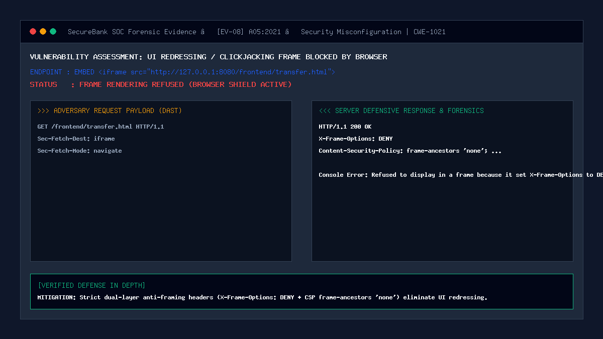

# 08 — UI Redressing / Clickjacking on Transfer Page

| | |
|---|---|
| **Severity** | Medium |
| **CVSS** | 5.4 (CVSS:3.1/AV:N/AC:L/PR:N/UI:R/S:U/C:N/I:L/A:N) |
| **OWASP** | A05:2021 – Security Misconfiguration |
| **CWE** | CWE-1021 (Improper Restriction of Rendered UI Layers or Frames) |
| **Endpoint** | `ALL /frontend/*.html` (secure) |
| **Status** | ✅ Mitigated |

## Summary
Clickjacking (User Interface Redressing) occurs when an attacker embeds a target application within a transparent or deceptive `<iframe>` on an attacker-controlled website. The attacker overlays tempting decoy elements (such as "Click here to claim a \$1,000 prize!") directly over sensitive buttons within the framed application (such as "Confirm \$1,000 Transfer"). When the victim clicks the visible decoy, the browser registers the click within the embedded banking portal, triggering unintentional financial transactions.

## Prerequisites
- Victim has an active authenticated session.
- Attacker lures victim to an external webpage hosting the framing iframe.

## What the Vulnerable Code Looks Like

```html
<!-- ⚠️ INTENTIONALLY INSECURE ATTACKER HTML — for demonstration only -->
<html>
<head>
  <style>
    /* Attacker makes the legitimate banking portal completely transparent */
    iframe {
      position: absolute;
      top: 0; left: 0;
      opacity: 0.0001;
      z-index: 2;
    }
    /* Decoy button perfectly aligned underneath the portal's "Transfer" button */
    .decoy-btn {
      position: absolute;
      top: 250px; left: 150px;
      z-index: 1;
      background: red; color: white;
    }
  </style>
</head>
<body>
  <button class="decoy-btn">🎁 CLICK HERE FOR FREE GIFT!</button>
  <iframe src="http://127.0.0.1:8080/frontend/transfer.html"></iframe>
</body>
</html>
```

Without anti-framing headers, the browser renders the banking page inside the frame, allowing the click to pass through to the transfer form.

## How Our Code Fixes It (Secure Implementation)

SecureBank enforces anti-framing defense across all HTTP responses through dual-layer middleware in `security/security_headers.php`:

```php
// In security/security_headers.php:

// 1. Legacy Standard: Instructs all browsers to unconditionally refuse framing
header('X-Frame-Options: DENY');

// 2. Modern W3C Standard: Content-Security-Policy frame-ancestors directive
header("Content-Security-Policy: default-src 'self'; frame-ancestors 'none'; script-src 'self' 'nonce-$cspNonce'; ...");
```

Browser Behavior When Defenses Are Active:
- When a page receives `X-Frame-Options: DENY`, the browser immediately halts frame rendering and outputs an error to the DevTools console:
  ```text
  Refused to display 'http://127.0.0.1:8080/frontend/transfer.html' in a frame because it set 'X-Frame-Options' to 'DENY'.
  ```
- The iframe area remains completely blank, neutralizing all UI redressing attempts.

## Proof of Concept / Attack Vector

Attacker loads the framing exploit page ([`docs/clickjacking-attack.html`](../clickjacking-attack.html)):
1. Open [`docs/clickjacking-attack.html`](../clickjacking-attack.html) in Chrome or Edge.
2. Inspect the red dashed sandbox area.
3. Observe the browser frame refusal: The iframe fails to render the banking application.

## Forensic Evidence & Mitigation Output


- **HTTP Response Headers**:
  - `X-Frame-Options: DENY`
  - `Content-Security-Policy: frame-ancestors 'none'`
- **Browser Protection**: 100% frame blocking across Chromium, Firefox, WebKit, and Safari.

## Automated Regression Test
- **Test File**: [`tests/attacks/test_08_clickjacking.php`](../../tests/attacks/test_08_clickjacking.php)
- **Run Command**:
  ```bash
  php tests/attacks/test_08_clickjacking.php
  ```

## Defense-in-Depth Measures
1. **Frame Ancestors 'None'**: Prevents framing even if `X-Frame-Options` is stripped by an intermediary proxy.
2. **Transaction Re-Authentication**: High-value transfers require an out-of-band confirmation or OTP step, rendering single-click attacks inert.
3. **SameSite=Strict Cookies**: Prevents ambient authentication from attaching to framed cross-origin sub-requests.
