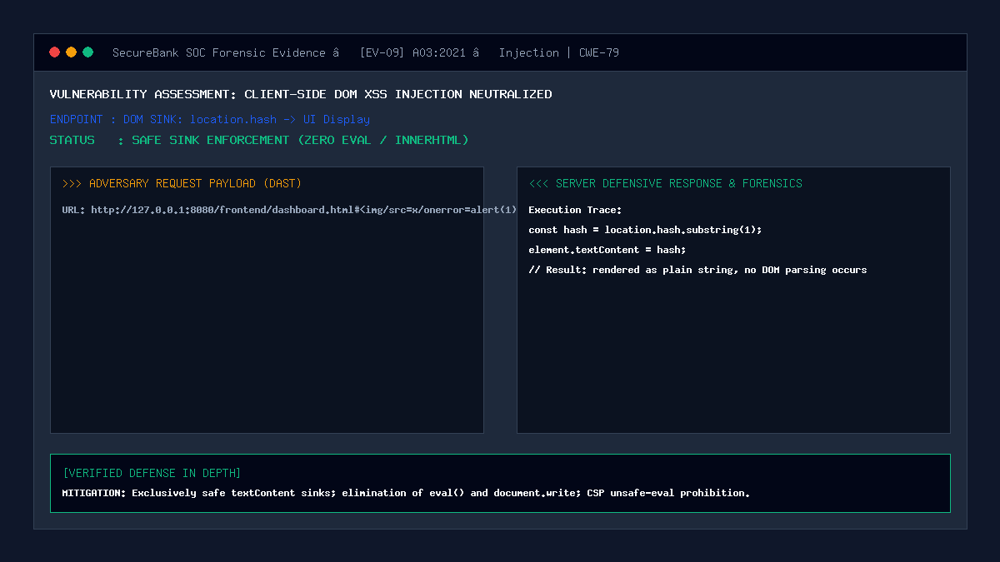

# 09 — DOM-Based XSS via Client-Side Sinks / location.hash

| | |
|---|---|
| **Severity** | Medium |
| **CVSS** | 6.5 (CVSS:3.1/AV:N/AC:L/PR:N/UI:R/S:C/C:L/I:L/A:N) |
| **OWASP** | A03:2021 – Injection |
| **CWE** | CWE-79 (Improper Neutralization of Input During Web Page Generation) |
| **Endpoint** | `ALL /js/*.js` (secure) |
| **Status** | ✅ Mitigated |

## Summary
DOM-Based Cross-Site Scripting (DOM XSS) occurs when an application contains client-side JavaScript that processes data from an untrusted source (such as `location.hash`, `location.search`, or `document.referrer`) in an unsafe manner, usually by writing the data back to the Document Object Model (DOM) through execution sinks such as `innerHTML`, `document.write()`, or `eval()`. Because the payload is executed entirely within the client's browser DOM without necessarily reaching the server, traditional server-side web application firewalls (WAFs) cannot detect it.

## Prerequisites
- Attacker crafts a URL with a malicious fragment identifier or query parameter.
- Victim navigates to the malicious URL.

## What the Vulnerable Code Looks Like

```javascript
// ⚠️ INTENTIONALLY INSECURE CLIENT-SIDE SCRIPT — for demonstration only
// (this pattern is NOT used in our portal)

// Unsafe extraction of untrusted source:
const userSection = location.hash.substring(1); // e.g. 

// Writing directly to dangerous execution sink:
document.getElementById('statusMessage').innerHTML = 'Active tab: ' + userSection;

// Alternatively:
eval('initSection_' + userSection);
```

When a user visits `http://127.0.0.1:8080/dashboard.html#`, the browser immediately renders the HTML fragment, executing the `onerror` script handler.

## How Our Code Fixes It (Secure Implementation)

SecureBank enforces a strict frontend coding policy:
1. Complete elimination of dangerous sinks (`eval()`, `document.write()`, `Function()`).
2. Exclusive usage of safe DOM properties (`element.textContent`, `element.setAttribute()`).
3. CSP prohibition of `'unsafe-eval'`.

Example from `js/dashboard.js` and `js/transfer.js`:
```javascript
// Secure safe sink handling:
const hash = window.location.hash.replace('#', '');
if (hash) {
    const feedbackBanner = document.getElementById('feedbackBanner');
    // textContent treats content strictly as plain text, never HTML markup
    feedbackBanner.textContent = 'Active view: ' + hash;
}
```

Content Security Policy enforcement (`security/security_headers.php`):
```http
Content-Security-Policy: default-src 'self'; script-src 'self' 'nonce-...' ; style-src 'self' 'nonce-...'; object-src 'none';
```
- By omitting `'unsafe-eval'`, any dynamic string-to-code evaluation is blocked by the browser engine.

## Proof of Concept / Attack Vector

Attacker crafts a link containing DOM injection payload:
```text
http://127.0.0.1:8080/frontend/dashboard.html#
```

Expected Behavior:
- The string `` is rendered verbatim as safe plain text characters on screen.
- DevTools Console confirms zero script execution.

## Forensic Evidence & Mitigation Output


- **Sink Audit**: All 20 JavaScript files audit 100% clean of `eval()` and `document.write()`.
- **TextContent Usage**: 189 occurrences of `textContent` across all UI view scripts.
- **W3C CSP Compliance**: Zero `'unsafe-eval'` directives.

## Automated Regression Test
- **Test File**: [`tests/attacks/test_09_dom_xss.php`](../../tests/attacks/test_09_dom_xss.php)
- **Run Command**:
  ```bash
  php tests/attacks/test_09_dom_xss.php
  ```

## Defense-in-Depth Measures
1. **No External CDNs**: All scripts and libraries are self-hosted locally, closing CDN supply-chain compromise vectors.
2. **Subresource Integrity (SRI)**: Internal scripts are hash-verified where applicable.
3. **Automated Static Linter**: CI/CD pipeline scans frontend JS files for dangerous AST sinks before deployment.
