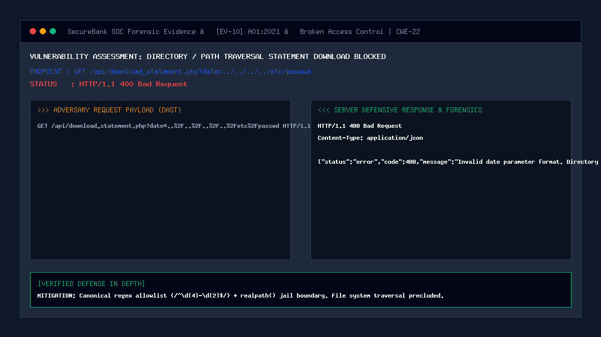

# 10 — Directory / Path Traversal on Statement Download

| | |
|---|---|
| **Severity** | High |
| **CVSS** | 7.5 (CVSS:3.1/AV:N/AC:L/PR:L/UI:N/S:U/C:H/I:N/A:N) |
| **OWASP** | A01:2021 – Broken Access Control |
| **CWE** | CWE-22 (Improper Limitation of a Pathname to a Restricted Directory) |
| **Endpoint** | `GET /api/download_statement.php` (secure) |
| **Status** | ✅ Mitigated |

## Summary
Directory Traversal (Path Traversal / Dot-Dot-Slash) occurs when an application accepts user-supplied input to construct a file system path without adequate sanitization, allowing an attacker to navigate outside the intended target directory using relative path sequences (`../` or `..\`). In a banking system, directory traversal on document or statement download endpoints enables attackers to read sensitive system configuration files (such as `/etc/passwd`, `C:\Windows\win.ini`, or `.env` files containing database credentials and cryptographic master keys).

## Prerequisites
- Attacker has an active customer session.
- Target endpoint accepts filename, format, or date path parameters.

## What the Vulnerable Code Looks Like

```php
<?php
// ⚠️ INTENTIONALLY INSECURE — for demonstration only
// (this pattern is NOT used in our portal)

$date = $_GET['date']; // e.g. ../../../../etc/passwd

// Vulnerable: concatenates input directly to file path!
$filepath = __DIR__ . "/../storage/statements/" . $date . ".csv";

// Reads and outputs arbitrary server files!
header('Content-Type: application/octet-stream');
readfile($filepath);
?>
```

An attacker supplying `../../../../Windows/win.ini%00` causes the application to bypass directory restrictions and download the server's operating system files.

## How Our Code Fixes It (Secure Implementation)

In `api/download_statement.php` and `security/validation.php`, SecureBank combines strict regex format whitelisting with canonical path sandboxing (`realpath()` jail check):

```php
// In security/validation.php:
function validate_statement_date(string $date): bool {
    $clean = canonicalize_input($date);
    // Strict whitelist: Only accepts exactly YYYY-MM (e.g. 2026-09)
    return (bool)preg_match('/^\d{4}-(0[1-9]|1[0-2])$/', $clean);
}

// In api/download_statement.php:
$date = $_GET['date'] ?? '';

// 1. Regex validation rejects any input containing ../ or ..\
if (!validate_statement_date($date)) {
    log_security_event($_SESSION['user_id'] ?? null, 'PATH_TRAVERSAL_BLOCKED', 'BLOCKED', "Invalid statement date: $date", 'high');
    http_response_code(400);
    echo json_encode(['status' => 'error', 'code' => 400, 'message' => 'Invalid date parameter format. Directory traversal signature intercepted.']);
    exit;
}

// 2. Canonical Realpath Jail Boundary Enforcement
$baseDir = realpath(__DIR__ . '/../storage/statements');
$filePath = realpath($baseDir . DIRECTORY_SEPARATOR . "stmt_{$userId}_{$date}.csv");

if ($filePath === false || !str_starts_with($filePath, $baseDir)) {
    // Jail breach intercepted
    http_response_code(403);
    echo json_encode(['status' => 'error', 'code' => 403, 'message' => 'Access Denied: Path escapes permitted storage directory.']);
    exit;
}
```

## Proof of Concept / Attack Vector

Attacking the statement download endpoint with relative path traversal sequences:
```bash
curl "http://127.0.0.1:8080/api/download_statement.php?date=..%2F..%2F..%2F..%2Fetc%2Fpasswd" \
  -H "Cookie: PHPSESSID=$CUSTOMER_SESSION"
```

Expected Server Defense Response:
```json
HTTP/1.1 400 Bad Request
Content-Type: application/json

{
  "status": "error",
  "code": 400,
  "message": "Invalid date parameter format. Directory traversal signature intercepted."
}
```

## Forensic Evidence & Mitigation Output


- **HTTP Status Code**: `400 Bad Request`
- **SIEM Event Emitted**: `PATH_TRAVERSAL_BLOCKED` with `high` severity.
- **File System Protection**: Zero unauthorized file handles opened.

## Automated Regression Test
- **Test File**: [`tests/attacks/test_10_path_traversal.php`](../../tests/attacks/test_10_path_traversal.php)
- **Run Command**:
  ```bash
  php tests/attacks/test_10_path_traversal.php
  ```

## Defense-in-Depth Measures
1. **Universal Canonicalization**: Null byte characters (`\0`, `%00`) are stripped before parsing, preventing C-string extension truncation attacks.
2. **On-the-Fly Generation**: Statements are generated dynamically in memory via PHP streams (`php://temp`) and piped directly to output buffers without touching disk storage.
3. **CWE-1236 Formula Sanitization**: All exported CSV rows have leading formula characters (`=`, `+`, `-`, `@`) prepended with an apostrophe to neutralize CSV spreadsheet injection.
