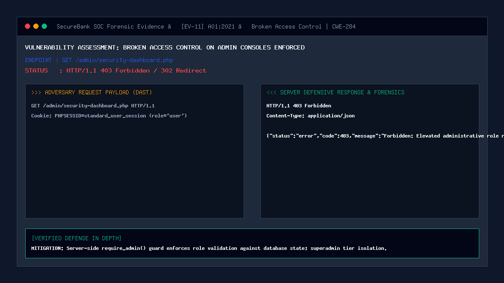

# 11 — Broken Access Control on Admin Routes

| | |
|---|---|
| **Severity** | Critical |
| **CVSS** | 9.1 (CVSS:3.1/AV:N/AC:L/PR:L/UI:N/S:U/C:H/I:H/A:H) |
| **OWASP** | A01:2021 – Broken Access Control |
| **CWE** | CWE-284 (Improper Access Control) |
| **Endpoint** | `ALL /admin/*.php` (secure) |
| **Status** | ✅ Mitigated |

## Summary
Broken Access Control (BAC) occurs when an application fails to properly enforce restrictions on what authenticated users are allowed to do. While users are authenticated, the access control layer fails to verify their role or authorization level before granting access to privileged resources. In a banking platform, vertical Broken Access Control allows a standard retail customer to access internal administrative consoles—enabling them to view real-time SIEM feeds, tamper with cryptographic audit chains, unfreeze suspended criminal accounts, or alter administrative detection rules.

## Prerequisites
- Attacker has an active retail banking customer account (`role = 'user'`).
- Attacker attempts to navigate directly to `/admin/security-dashboard.php`, `/admin/users.php`, `/admin/alerts.php`, or `/admin/verify_log_chain.php`.

## What the Vulnerable Code Looks Like

```php
<?php
// ⚠️ INTENTIONALLY INSECURE — for demonstration only
// (this pattern is NOT used in our portal)

session_start();

// Vulnerable: checks ONLY that user is logged in, but NEVER checks their role!
if (empty($_SESSION['user_id'])) {
    header('Location: /login.html');
    exit;
}

// Allows ordinary retail users to access elevated SOC controls!
render_admin_security_console();
?>
```

An ordinary customer simply types `http://127.0.0.1:8080/admin/security-dashboard.php` into their address bar to access the entire administrative backend.

## How Our Code Fixes It (Secure Implementation)

SecureBank enforces server-side Role-Based Access Control (RBAC) at the very top of every administrative file before any processing occurs:

```php
// In security/auth.php:
function require_role(string|array $requiredRole): array {
    start_secure_session();

    // 1. Enforce authentication presence
    if (empty($_SESSION['user_id']) || empty($_SESSION['role'])) {
        header('Location: ../frontend/login.html');
        exit;
    }

    $userRole = $_SESSION['role'];
    $allowed = is_array($requiredRole) ? $requiredRole : [$requiredRole];

    // 2. Enforce strict role authorization match
    if (!in_array($userRole, $allowed, true)) {
        log_security_event(
            $_SESSION['user_id'], 
            'UNAUTHORIZED_ACCESS', 
            'BLOCKED', 
            "User with role '$userRole' attempted unauthorized access to elevated route " . ($_SERVER['REQUEST_URI'] ?? ''), 
            'critical'
        );
        http_response_code(403);
        echo "<!DOCTYPE html><html><body><h1>403 Forbidden</h1><p>Elevated administrative role required.</p></body></html>";
        exit;
    }

    // 3. Return verified admin context
    return [
        'id'       => (int)$_SESSION['user_id'],
        'username' => $_SESSION['username'],
        'role'     => $userRole
    ];
}

function require_admin(): array {
    return require_role(['admin', 'superadmin']);
}
```

Super-Administrator Separation (`admin/alerts.php`):
```php
// Tier separation: Even ordinary administrators cannot modify core SIEM detection policies
if ((int)$admin['id'] !== 1) {
    $actionError = "Forbidden: Only Primary Super-Administrator (ID: 1) is permitted to modify SIEM alert policies.";
}
```

## Proof of Concept / Attack Vector

Attacker logs in as customer `john_doe` (`role = 'user'`) and attempts to access the admin user directory:
```bash
curl -i "http://127.0.0.1:8080/admin/users.php" \
  -H "Cookie: PHPSESSID=$CUSTOMER_SESSION_ID"
```

Expected Server Defense Response:
```text
HTTP/1.1 403 Forbidden
Content-Type: text/html; charset=UTF-8

<!DOCTYPE html><html><body><h1>403 Forbidden</h1><p>Elevated administrative role required.</p></body></html>
```

## Forensic Evidence & Mitigation Output


- **HTTP Status Code**: `403 Forbidden`
- **SIEM Event Emitted**: `UNAUTHORIZED_ACCESS` logged with `critical` severity.
- **Access Boundary**: Zero administrative telemetry or user records rendered.

## Automated Regression Test
- **Test File**: [`tests/attacks/test_11_bac.php`](../../tests/attacks/test_11_bac.php)
- **Run Command**:
  ```bash
  php tests/attacks/test_11_bac.php
  ```

## Defense-in-Depth Measures
1. **Server-Side Authority**: Role authorization checks database/session state on the server; client-side UI hiding is never relied upon as a security boundary.
2. **Re-Authentication on Privilege Escalation**: Transitioning to super-admin operations requires active 2FA confirmation.
3. **Dual-Tier Session Timeouts**: Administrative sessions enforce an aggressive 15-minute inactivity idle window.
