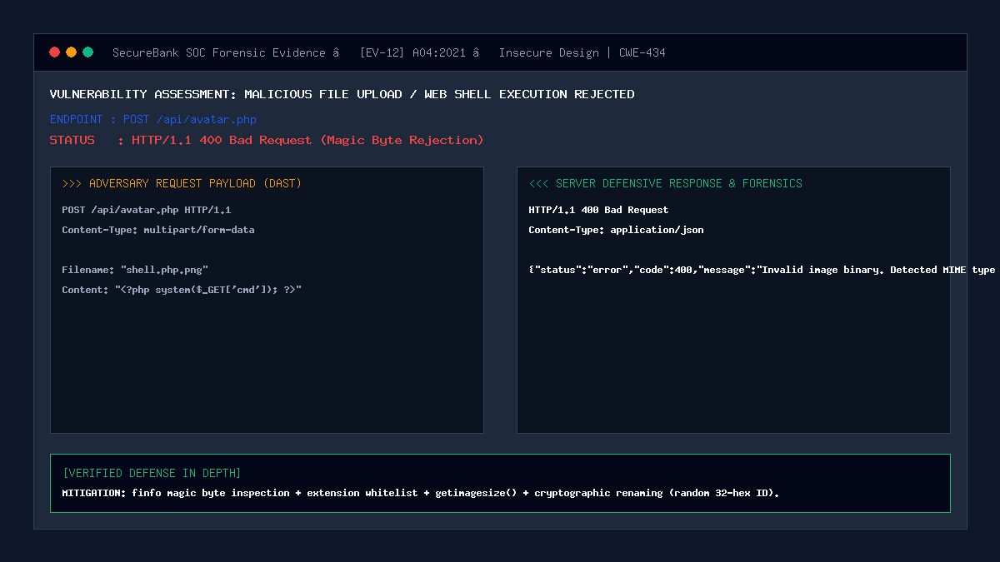

# 12 — Malicious File Upload (Avatar Upload)

| | |
|---|---|
| **Severity** | Critical |
| **CVSS** | 9.8 (CVSS:3.1/AV:N/AC:L/PR:L/UI:N/S:U/C:H/I:H/A:H) |
| **OWASP** | A04:2021 – Insecure Design / A08:2021 – Software and Data Integrity Failures |
| **CWE** | CWE-434 (Unrestricted Upload of File with Dangerous Type) |
| **Endpoint** | `POST /api/avatar.php` (secure) |
| **Status** | ✅ Mitigated |

## Summary
Unrestricted File Upload occurs when an application allows users to upload files to its file system without validating their file type, contents, extensions, or size. Attackers exploit file upload functionality (such as customer profile avatar uploads) to upload polyglot web shells (e.g. PHP scripts disguised as images: `shell.php.png` or `backdoor.php`). If the web server allows scripts in the upload directory to execute, the attacker achieves Remote Code Execution (RCE), gaining complete control over the host operating system, memory space, and database backend.

## Prerequisites
- Attacker has an active customer session.
- Profile avatar upload endpoint (`POST /api/avatar.php`) is accessible.

## What the Vulnerable Code Looks Like

```php
<?php
// ⚠️ INTENTIONALLY INSECURE — for demonstration only
// (this pattern is NOT used in our portal)

$targetDir = "uploads/";
// Vulnerable: trusts client filename and extension blindly!
$targetFile = $targetDir . basename($_FILES["avatar"]["name"]);

// Saves attacker's shell.php directly to web-accessible directory!
move_uploaded_file($_FILES["avatar"]["tmp_name"], $targetFile);
?>
```

The attacker uploads `shell.php` with payload `<?php system($_GET['cmd']); ?>`, then navigates to `http://127.0.0.1:8080/uploads/shell.php?cmd=cat+/etc/passwd` to execute arbitrary server commands.

## How Our Code Fixes It (Secure Implementation)

In `api/avatar.php`, SecureBank enforces a rigorous 5-stage defensive pipeline before any file is saved:

```php
// In api/avatar.php:

// 1. File size bound (max 2MB to prevent DoS)
if ($_FILES['avatar']['size'] > 2 * 1024 * 1024) {
    http_response_code(400);
    echo json_encode(['status' => 'error', 'message' => 'File size exceeds maximum 2MB limit.']);
    exit;
}

// 2. Strict Extension Whitelist (rejection of all executable extensions)
$allowedExtensions = ['jpg', 'jpeg', 'png', 'webp'];
$clientExt = strtolower(pathinfo($_FILES['avatar']['name'], PATHINFO_EXTENSION));

if (!in_array($clientExt, $allowedExtensions, true)) {
    http_response_code(400);
    echo json_encode(['status' => 'error', 'message' => 'Invalid file extension. Only JPG, PNG, and WebP are permitted.']);
    exit;
}

// 3. Server-Side Magic Byte MIME Verification using finfo
$finfo = new finfo(FILEINFO_MIME_TYPE);
$realMime = $finfo->file($_FILES['avatar']['tmp_name']);
$allowedMimes = ['image/jpeg', 'image/png', 'image/webp'];

if (!in_array($realMime, $allowedMimes, true)) {
    log_security_event($_SESSION['user_id'], 'MALICIOUS_UPLOAD_BLOCKED', 'BLOCKED', "Spoofed MIME type: $realMime", 'critical');
    http_response_code(400);
    echo json_encode(['status' => 'error', 'message' => 'File header mismatch: binary is not a valid image.']);
    exit;
}

// 4. Image Geometry Verification (prevents image/code polyglots)
$imageInfo = @getimagesize($_FILES['avatar']['tmp_name']);
if ($imageInfo === false) {
    http_response_code(400);
    echo json_encode(['status' => 'error', 'message' => 'Image corrupt or invalid geometry.']);
    exit;
}

// 5. Cryptographic Randomized Renaming & Safe Storage Directory
$safeName = bin2hex(random_bytes(16)) . '.' . $clientExt;
$destination = __DIR__ . '/../storage/avatars/' . $safeName;
move_uploaded_file($_FILES['avatar']['tmp_name'], $destination);
```

Storage Directory Defense (`storage/avatars/.htaccess`):
```apache
# Disable PHP execution inside upload directories
php_flag engine off
RemoveHandler .php .phtml .php5 .phar
Options -ExecCGI -Indexes
```

## Proof of Concept / Attack Vector

Attacker attempts to upload a PHP web shell disguised with a PNG extension:
```bash
curl -X POST http://127.0.0.1:8080/api/avatar.php \
  -H "Cookie: PHPSESSID=$CUSTOMER_SESSION" \
  -H "X-CSRF-Token: $CSRF_TOKEN" \
  -F "avatar=@shell.php.png;type=image/png"
```
Where `shell.php.png` contains raw PHP system commands.

Expected Server Defense Response:
```json
HTTP/1.1 400 Bad Request
Content-Type: application/json

{
  "status": "error",
  "code": 400,
  "message": "File header mismatch: binary is not a valid image."
}
```

## Forensic Evidence & Mitigation Output


- **HTTP Status Code**: `400 Bad Request`
- **SIEM Event Emitted**: `MALICIOUS_UPLOAD_BLOCKED` logged with `critical` severity.
- **Integrity Preserved**: The spoofed PHP binary was rejected during `finfo` magic byte inspection; zero files written to disk.

## Automated Regression Test
- **Test File**: [`tests/attacks/test_12_file_upload.php`](../../tests/attacks/test_12_file_upload.php)
- **Run Command**:
  ```bash
  php tests/attacks/test_12_file_upload.php
  ```

## Defense-in-Depth Measures
1. **Zero Client Name Trust**: Original filenames are discarded; only a 32-character CSPRNG hex string is stored.
2. **Execution Neutralization**: Web server configuration explicitly disables the PHP engine inside the `storage/` directory.
3. **No Direct URL Execution**: Avatars are served through an image proxy or rendered via static base64 data URIs.
